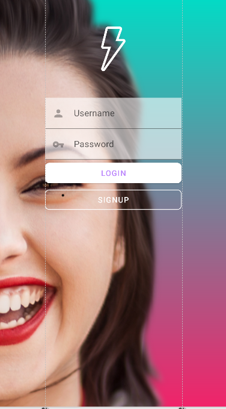
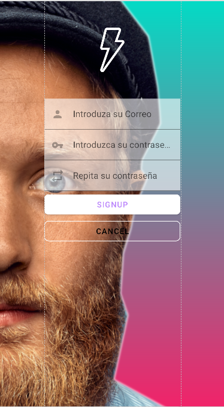
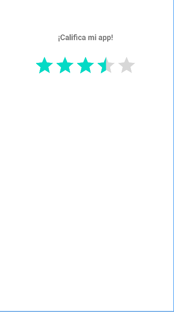
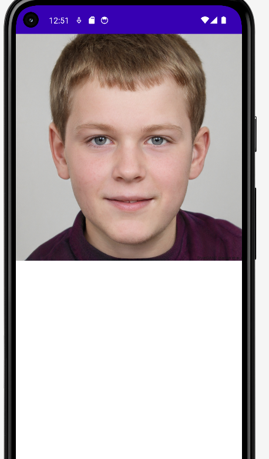
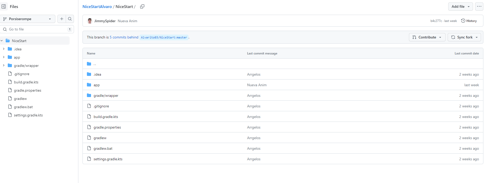
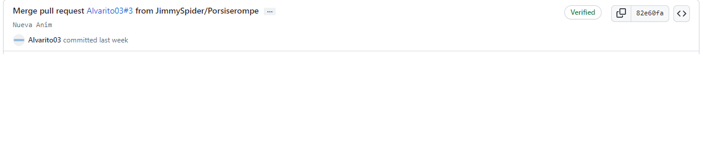

## Nice Start

Esto es el  **readme** de una práctica

**En esta imagen podemos ver la la página de inicio utilizada en la app**

**Y en esta otra podemos ver la página de registro**

**En esta otra imagen podemos ver el splash de inicio de mi app**

**Y en esta imagen podemos ver el main de mi app con una valoración de la app**

**Aqui he creado parte de la app linkeada a un generador de personas que no existe,
cada vez que refrescas la página genera una persona que no existe aleatoria**

**Hice un pull request a Alvaro Guadalupe**

